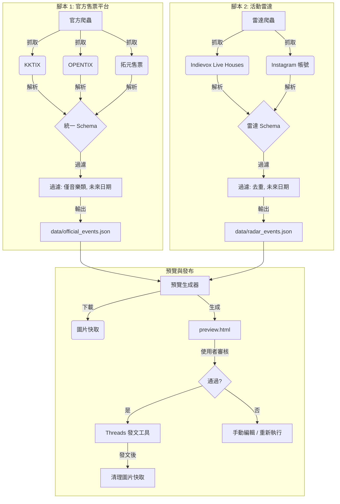

# 系統架構：台灣音樂活動爬蟲

## 概述
本系統旨在聚合台灣官方售票平台與地下/社群來源的音樂活動資訊。採用**雙腳本架構**以平衡資料可靠性與覆蓋率。

## 資料流程圖

## 元件邏輯

### 1. 官方售票爬蟲 (`scrape_official_platforms.py`)
- **目標**: 高準確度、結構化資料
- **來源**:
  - **KKTIX**: 爬取「音樂」分類 (Tag 13)
  - **OPENTIX**: 爬取完整音樂子分類
  - **拓元售票**: 爬取主要活動列表
- **核心邏輯**:
  - **嚴格過濾**: 僅明確標示為「音樂」或「演唱會」類型的活動
  - **Schema**:
    - `activity_id`: 唯一 ID (平台 + 名稱 + 日期)
    - `image_url`: 視覺化貼文必要欄位
    - `ticket_url`: 購票連結

### 2. 活動雷達爬蟲 (`scrape_activity_radar.py`)
- **目標**: 高覆蓋率，特別是主流平台未收錄的活動
- **來源**:
  - **Indievox**: 作為多數 Live House 的售票引擎代理 (Legacy, The Wall 等)
  - **Instagram**: 直接監控場地官方帳號的傳單/貼文
- **核心邏輯**:
  - **盡力而為**: 接受不完整資料 (例如未知票價)
  - **日期解析**: 從社群貼文文字啟發式解析日期

### 3. 預覽生成器 (`preview_generator.py`)
- **目標**: 發文前視覺化驗證
- **流程**:
  1. 讀取 JSON 輸出
  2. 下載圖片至本地快取 (`data/preview_cache/`)
  3. 生成響應式 HTML 檔案 (`preview.html`)
  4. 允許使用者驗證內容與圖片

### 4. Threads 發文工具 (`post_to_threads.py`)
- **目標**: 自動發布活動資訊至 Threads
- **流程**:
  1. 讀取已驗證的 JSON 資料
  2. 格式化貼文文字
  3. 上傳圖片至 Threads
  4. 發布貼文
  5. 清理圖片快取

